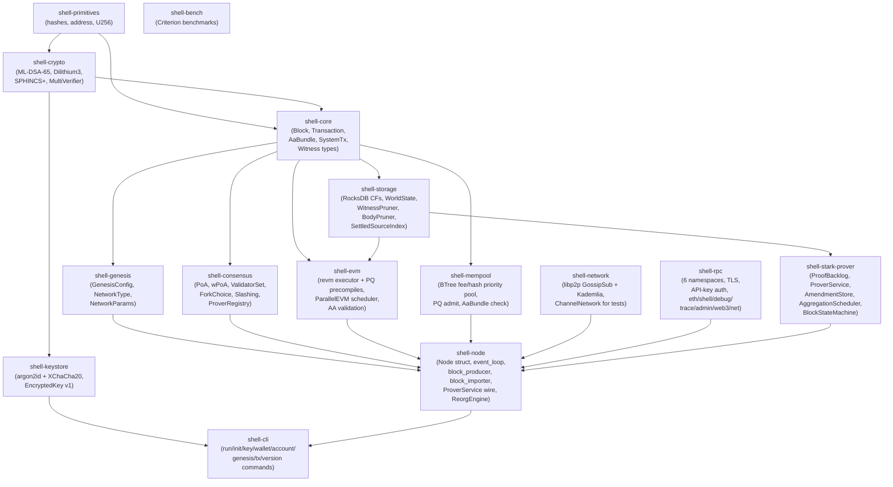
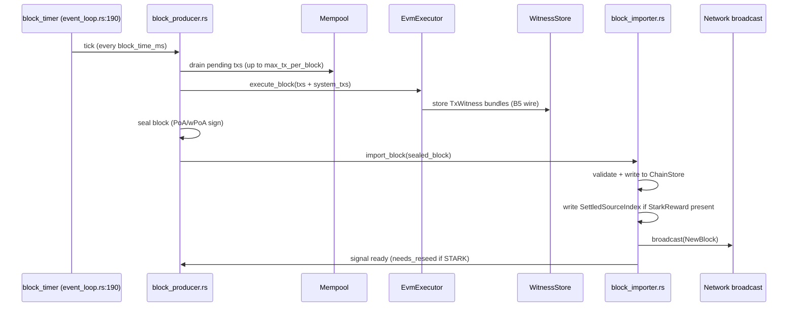
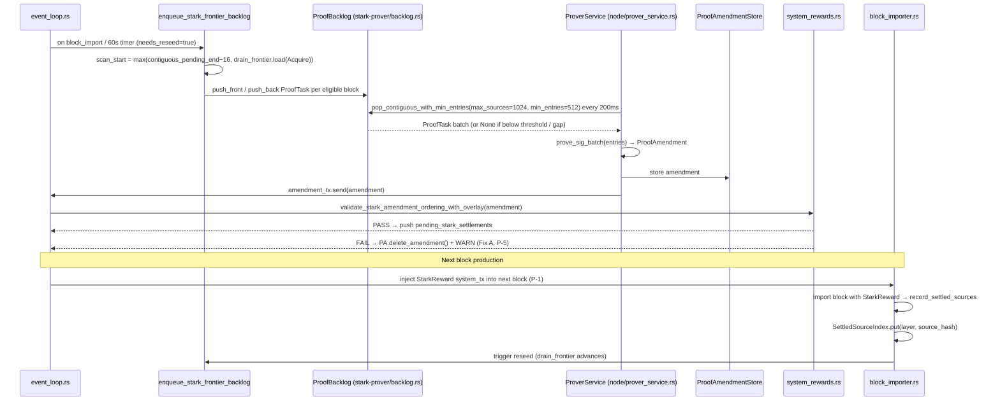
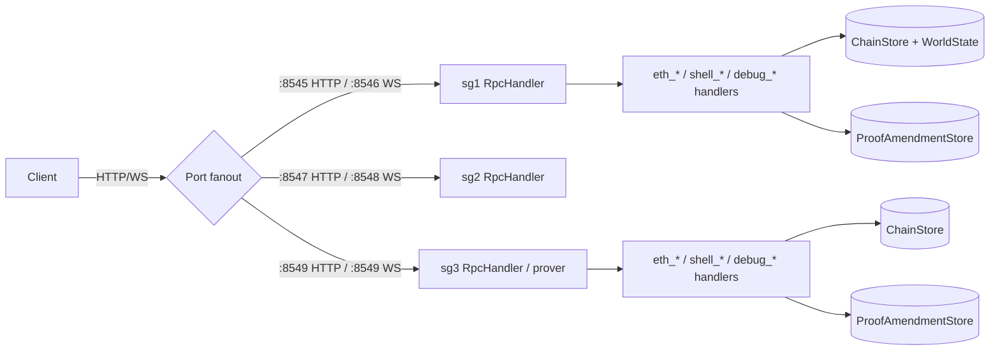
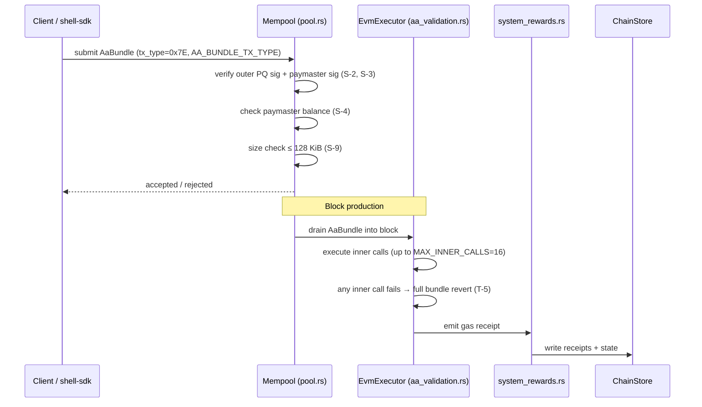
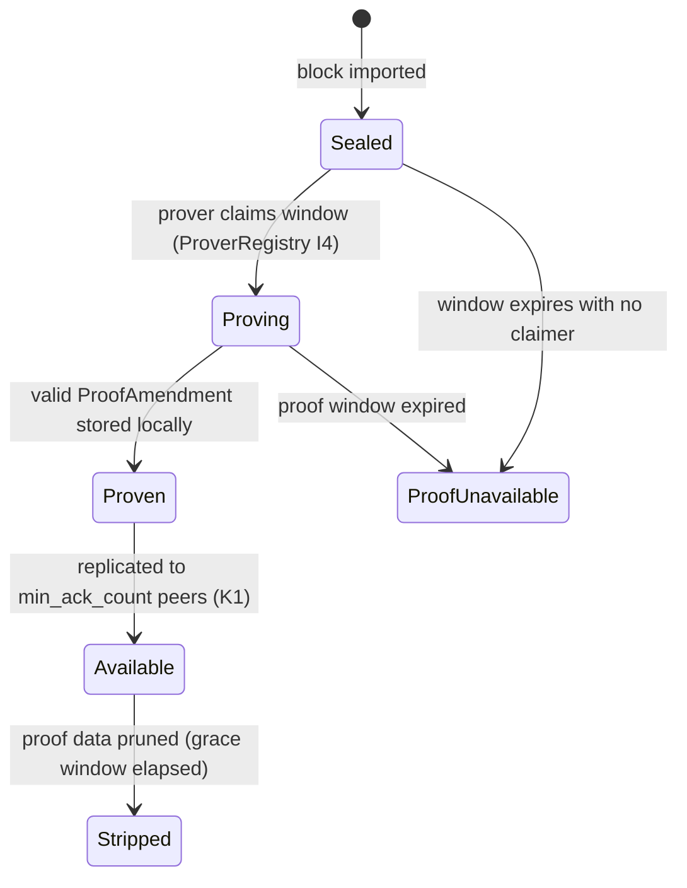
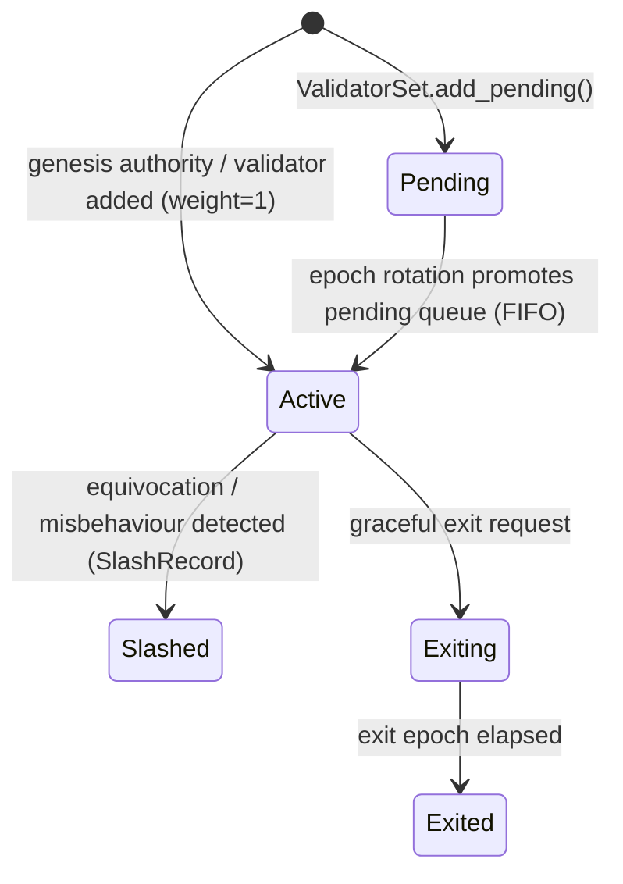

# Shell-Chain Architecture — v0.22.2

> **Version**: 1.0 — aligned with shell-chain `v0.22.2` (2026-05-12)
> **Audience**: Engineers and AI agents working on Shell-Chain.
> **Relationship to CONSTITUTION**: The Constitution (`CONSTITUTION.md`) states the **must** rules
> (invariants, tenets, wire-format constants, quality gates). This document states the **is** —
> what actually exists, how components connect, and where to look. When they conflict, the
> Constitution wins; file a drift audit.

---

## 1. Purpose & Scope

This document is the single navigational reference for Shell-Chain's runtime architecture.
It covers crate topology, data flows, state machines, storage layout, concurrency model,
and operational topology for v0.22.2. It does **not** repeat Constitutional invariants verbatim;
instead it cross-references them with precise `file:line` citations so reviewers can
verify the code enforces them.

Read this document when you need to understand how a piece fits into the whole. Read the
Constitution when you need to know what rules apply. Read individual crate `spec.md` files
when you need field-level wire format details.

---

## 2. System Overview

Shell-Chain is a PQ-native (post-quantum) Layer-1 blockchain built in Rust. It runs the
Cancun-era EVM with ECDSA-recovery disabled and PQ signing (ML-DSA-65 / Dilithium3 /
SPHINCS+) wired throughout. Account Abstraction (`AaBundle`) is a first-class transaction
model. STARK aggregate proof settlement is live in async, asynchronous pipeline writing
`StarkReward` system transactions into following blocks.

**Deployment topologies:**

| Topology | Nodes | Boot | Block time | Prover |
|---|---|---|---|---|
| Devnet (local Docker) | 1 (combined validator+prover) | `./dev.sh up` | 30 s (idle-skip on) | disabled by default |
| SG public testnet | 3 validators (`sg1/sg2/sg3`), `sg3` runs prover | systemd units via `setup-systemd.sh` | 2 s | async STARK L1 live |

---

## 3. Crate Topology



**Hard topology rules** (Constitution §3):
- `primitives` / `crypto` / `core` **must not** depend on `rpc` / `node` / `cli`.
- `rpc` **must not** directly call `storage`; it routes through `node` handler dispatch.

---

## 4. Component Map

| Crate | Role | Key public types | Test command |
|---|---|---|---|
| `shell-primitives` | Foundational types — hashes, address, U256 | `ShellHash`, `Address`, `Bytes`, `U256`, `keccak256`, `blake3_hash` | `cargo test -p shell-primitives` |
| `shell-crypto` | PQ signing/verification — ML-DSA-65 (FIPS 204), Dilithium3, SPHINCS+, multi-dispatch, batch | `MlDsaSigner`, `DilithiumSigner`, `SphincsSigner`, `MultiVerifier`, `BatchVerifier`, `SignatureType`, `ALLOWED_ALGORITHMS` | `cargo test -p shell-crypto` |
| `shell-keystore` | Keystore v1 — argon2id KDF + XChaCha20-Poly1305 cipher, sk-only ciphertext | `EncryptedKey`, `KeystoreV1`, `encrypt_dilithium`, `encrypt_mldsa`, `decrypt_keystore` | `cargo test -p shell-keystore` |
| `shell-core` | Block / transaction wire types, AA bundle, system txs, witness types, EIP-1559/4844 fee model | `Block`, `StrippedBlock`, `SignedTransaction`, `AaBundle`, `SystemTransaction`, `SystemTxKind`, `StarkRewardParams`, `TxWitness`, `WitnessBundle` | `cargo test -p shell-core` |
| `shell-genesis` | Genesis file parsing, `NetworkType` defaults, authority key initialization | `GenesisConfig`, `NetworkType`, `NetworkParams`, `initialize_authority_pubkeys` | `cargo test -p shell-genesis` |
| `shell-storage` | RocksDB column families, world state, MPT, pruners, settled source index, durable L2 job store | `RocksDb`, `WorldState`, `ChainStore`, `WitnessStore`, `WitnessPruner`, `BodyPruner`, `StatePruner`, `SettledSourceIndex`, `L2InputIndex`, `L2JobStore`, `GuardianConfig` | `cargo test -p shell-storage` |
| `shell-consensus` | PoA block validation, wPoA weights, `ValidatorSet` lifecycle, fork choice, slashing, commit certs | `PoaEngine`, `WPoaEngine`, `ValidatorSet`, `ValidatorInfo`, `ValidatorStatus`, `ForkChoice`, `SlashRecord`, `FinalityState`, `ProverRegistry` | `cargo test -p shell-consensus` |
| `shell-evm` | revm executor, PQ precompiles (`PQ_DILITHIUM_VERIFY` @ `0x0100`), AA validation, ParallelEVM | `EvmExecutor`, `ExecutionContext`, `AaValidator`, `PqDilithiumVerifyPrecompile`, `ParallelScheduler`, `TxReadWriteSet` | `cargo test -p shell-evm` |
| `shell-mempool` | Fee-ordered admit pool, PQ signature check, AaBundle admit, MAX_TX_SIZE guard | `Mempool`, `Pool`, `MempoolEntry` | `cargo test -p shell-mempool` |
| `shell-network` | libp2p GossipSub + Kademlia peer discovery, `ChannelNetwork` in-process backend | `LibP2pNetwork`, `ChannelNetwork`, `NetworkMessage`, `BandwidthTracker`, `PeerBanList`, `PeerTracker` | `cargo test -p shell-network` |
| `shell-rpc` | JSON-RPC HTTP/WS, TLS proxy, API-key auth, 6 namespaces, STARK proof decode in responses | `RpcHandler`, `RpcServer`, `TlsProxy`, `ApiKeyAuth`, `BatchEstimateRequest` | `cargo test -p shell-rpc` |
| `shell-stark-prover` | STARK proof backlog, ProverService, amendment store, L2 aggregation scaffold | `ProofBacklog`, `ProofTask`, `ProofAmendment`, `ProofAmendmentStore`, `BlockStateMachine`, `BlockProofState`, `AggregationScheduler`, `L2JobStore`, `L2StarkMode` | `cargo test -p shell-stark-prover` |
| `shell-node` | Node harness — wires all crates, event loop, block production/import, ProverService | `Node<S>`, `NodeConfig`, `NodeRole`, `ProverOrchestratorBoundary`, `ProverServiceHandle`, `ReorgEngine`, `HistoricalSync` | `cargo test -p shell-node` |
| `shell-cli` | CLI entry point — `run`, `init`, `key`, `wallet`, `account`, `genesis`, `tx`, `version` | `CliArgs`, `KeyCmd`, `RunCmd`, `GenesisCmd`, `TxCmd` | `cargo test -p shell-cli` |
| `bench` | Criterion micro-benchmarks for storage, crypto, EVM | benchmark functions | `cargo bench -p bench` |

---

## 5. Data Flow Diagrams

### 5.1 Block Production



> **Idle-skip**: When mempool is empty and `time_since_last_block < max_idle_interval_ms`
> (default 60,000 ms), the tick is skipped. Heartbeat empty block fires after the interval.
> See `event_loop.rs:190-210`, CONSTITUTION §2.4 Invariant H-1.

### 5.2 STARK Proof Pipeline



> ADR-003: `drain_frontier` (`Arc<AtomicU64>`) updated via `fetch_max(gap, Release)` after
> every `drain_front()` call (`prover_service.rs:~260`). Seeder clamps accordingly (P-2).

### 5.3 RPC Fanout



> Ports are set via `--rpc-port` / `--ws-port` (CLI). Constitution §2.7 P-7 reserves
> `8545/8547/8549` (HTTP) and `8546/8548/8550` (WS) for the three-validator SG testnet.

### 5.4 Account Abstraction Bundle Path



---

## 6. Key Invariants (cross-ref CONSTITUTION P-1..P-7)

The following invariants were formalized as part of the v0.22.2 amendment audit
(`audit-constitution-report.md`). Each maps to a Constitutional clause (P-n) and a
concrete code location.

| Invariant | Description | Code location |
|---|---|---|
| **P-1** STARK Wire Protocol | `StarkReward` system tx is the **only** STARK settlement mechanism. `extra_data`-based settlement is rejected at import. | `crates/node/src/node/block_importer.rs:203-207` |
| **P-2** Drain-Frontier | `Arc<AtomicU64> stark_drain_frontier` is monotonically increasing. Seeder clamps `scan_start = max(contiguous_pending_end − 16, drain_frontier.load(Acquire))`. | `crates/node/src/node/mod.rs:150`, `event_loop.rs` (seeder), `prover_service.rs:~260` |
| **P-3** Witness Pruner STARK Guard | `WitnessPruner.prune_before()` effective cutoff = `min(retention_cutoff, stark_frontier)` when `stark_frontier > 0`. Prevents data-loss during catch-up. | `crates/storage/src/witness_pruner.rs:96-103` |
| **P-4** L2StarkMode | `L2StarkMode::Active` is forbidden in production until §13.1 promotion. `Disabled` (default) and `Scaffold` are safe. | `crates/node/src/config.rs:125-137` |
| **P-5** Tip-Loop Rejection Guard | Amendment artifacts that fail ordering validation are immediately deleted from `amendment_store`; not left as orphans. | `crates/node/src/node/event_loop.rs:308-331` |
| **P-6** Contiguous-Frontier Seeding | Backlog seeding anchors at `contiguous_pending_end` (contiguous gapless walk), **not** `pending_max_block`. | `crates/node/src/node/event_loop.rs` (enqueue fn) |
| **P-7** Three-Node RPC Fanout | SG testnet: ports 8545/8547/8549 (HTTP), 8546/8548/8550 (WS) for sg1/sg2/sg3 respectively. | `workspace/ops/shell-chain-testnet/DEPLOYMENT-RUNBOOK.md` |

Additional Constitutional invariants enforced in code:

| Const. | Code enforcement |
|---|---|
| T-1 PQ-Native | `ecrecover` returns OOG — `crates/evm/src/precompiles.rs` (S-1) |
| T-3 EVM Compat | revm Shanghai spec; only `PQ_DILITHIUM_VERIFY` precompile added at `0x0100` |
| T-5 Atomic AA | AA bundle inner call failure → full revert — `crates/evm/src/aa_validation.rs` |
| S-6 RPC gas cap | `eth_call` capped at 50 M gas — `crates/rpc/src/handler/mod.rs:353` |
| S-10 Timestamp | Block timestamp ≤ now + 60 s — `crates/consensus/src/poa.rs:29` |

---

## 7. Three-Layer Commit Flow

```mermaid
graph LR
    A[Pending block\n(in mempool / proposing)] -->|seal + broadcast + peer import| B[Settled block\n(canonical ChainStore,\nreceipts written)]
    B -->|StarkReward tx accepted\nin a following block| C[STARK-Settled\n(SettledSourceIndex entry,\ndrain frontier advances)]
    C -->|BFT quorum\ncommit certificate\nfinalityState advances| D[Finalized\n(FinalityState.finalized_number,\ncommit cert stored)]
```

**Key details per stage:**

- **Pending**: Transactions live in `Mempool`. A block is being assembled by `block_producer.rs`.
- **Settled**: `block_importer.rs` writes the block to `ChainStore` (CF_CHAIN), applies EVM
  state to WorldState (CF_STATE), writes receipts (CF_RECEIPTS), and indexes tx hashes
  (CF_INDEX). `WitnessStore` (CF_WITNESS) holds `TxWitness` bundles.
- **STARK-Settled**: A `StarkReward` system transaction in a later block is imported,
  calling `record_settled_sources()` which writes to `SettledSourceIndex` (`ss/` prefix in
  CF_INDEX). Witnesses for covered blocks are eligible for pruning only after this step (P-3).
- **Finalized**: wPoA quorum votes produce a commit certificate (BFT threshold met).
  `FinalityState.finalized_number` advances. Block import rejects conflicts with finalized
  heights. Exposed via `shell_getFinalityInfo` / `shell_finalityProof` RPC.

---

## 8. State Machines

### 8.1 ProverService / BlockProofState

Defined in `crates/stark-prover/src/state_machine.rs`:



**ProofBacklog states** (runtime, in `backlog.rs`):
- `pop_contiguous_with_min_entries` returns `None` if gap detected or entries < 512 (L1).
- `diagnose_stall()` — non-destructive; returns `(entries, gap_at_block, contiguous_take)`.
- `drain_front(n)` — removes N tasks; updates `source_index` + `layer_blocks` indexes.
  After drain, `ProverService` calls `drain_frontier.fetch_max(gap_at_block, Release)`.

**2-tick drain guard** (ADR-009, `prover_service.rs`):
Two consecutive `diagnose_stall` results showing the same `gap_at_block` (≥120 s total)
are required before `drain_front()` fires. State: `consecutive_gap: (u64, u32)`.

### 8.2 L2StarkMode

Defined in `crates/node/src/config.rs:125-137`:

```mermaid
stateDiagram-v2
    [*] --> Disabled : default (all network types)
    Disabled --> Scaffold : operator sets l2_stark_mode = "scaffold"
    Scaffold --> Active : §13.1 promotion + real recursive circuit (NOT yet reachable)
    note right of Active : L2StarkMode::Active\ngated behind `recursive` cargo feature;\nforbidden in production (P-4)
```

- `Disabled`: L2 pipeline inactive; `L2InputIndex` not maintained.
- `Scaffold`: Indexes canonical settled L1 inputs (`l2i/` prefix); observability only.
- `Active`: Calls real recursive `prove()`; `L2StarkMode::is_active()` returns true.

### 8.3 ValidatorSet Lifecycle

Defined in `crates/consensus/src/validator.rs:19`:



`ValidatorSet` fields: `validators: HashMap<Address, ValidatorInfo>`, `pending: VecDeque<ValidatorInfo>`.
Active set returned by `active_validators()` in deterministic order.

---

## 9. Storage Column Families

RocksDB is opened with five column families (`crates/storage/src/rocks_db.rs:36-46`):

| CF constant | `cf_name` | Contents | Bloom filter | Prunable |
|---|---|---|---|---|
| `CF_STATE` | `"state"` | Account state (MPT nodes, nonce, balance, code, storage) | ✅ | Snapshotted; state pruner trims old roots |
| `CF_CHAIN` | `"chain"` | Block headers, block bodies (`b/` prefix), canonical markers | ✅ | Body pruner; `DEFAULT_BODY_RETENTION = 512` blocks |
| `CF_RECEIPTS` | `"receipts"` | Transaction receipts, logs | ✅ | State pruner |
| `CF_INDEX` | `"index"` | Tx-hash → block index, address tx history, `ss/` settled-source, `l2i/` L2 input, `pa/` proof amendments | ❌ | Amendment + settled source auto-managed |
| `CF_WITNESS` | `"witness"` | `TxWitness` bundles per (block, tx_index) | ❌ | `WitnessPruner`; `DEFAULT_WITNESS_RETENTION = 128`; STARK guard (P-3) |

**Key prefixes inside `CF_INDEX`:**

| Prefix | Content |
|---|---|
| _(bare hash key)_ | `tx_hash → (block_number, tx_index)` |
| `addr:` | Address transaction history (`MAX_ADDRESS_TX_HISTORY_OFFSET = 10_000`) |
| `ss/` | Durable STARK settled-source index: `(layer, source_hash) → settlement_block` |
| `l2i/` | L2 input index: `source_hash → L2AggregationJob.compute_id()` |
| `pa/` | Proof amendment store: `block_hash → ProofAmendment` |

**Storage profiles** (Constitution §2.3, `T-8`):

| Profile | body_retention | witness_retention | proof_replacement_grace |
|---|---|---|---|
| `archive` | `u64::MAX` | `u64::MAX` | `u64::MAX` |
| `full` | `512` | `128` | normal |
| `light` | small | small | normal |

---

## 10. Concurrency Model

```
tokio::runtime (multi-thread)
├── event_loop task (main node loop)
│   ├── block_timer interval (event_loop.rs:190)
│   ├── tx_broadcast_rx channel (capacity 4096, event_loop.rs:75-77)
│   ├── block_event_tx broadcast::channel (capacity 256, event_loop.rs:82)
│   ├── prover_amendment_rx (mpsc from ProverService)
│   └── network_rx (P2P messages)
├── ProverService task (spawned on prover nodes)
│   ├── pops ProofBacklog every 200 ms
│   ├── spawns tokio::spawn per proof batch (async prove_sig_batch)
│   └── sends amendments via amendment_tx mpsc
├── RPC server task(s) (HTTP + WS, optionally TLS proxy)
├── libp2p network task (GossipSub + Kademlia)
├── observability task (/healthz, /readyz, /metrics)
└── block production task (validators only)

Shared state (Arc):
  stark_drain_frontier: Arc<AtomicU64>          → SeqCst/Acquire+Release
  proof_backlog:        Arc<Mutex<ProofBacklog>> → locked per pop/push/drain
  pending_stark_settlements: Arc<Mutex<Vec<..>>> → locked per block production
  settled_stark_sources: Arc<Mutex<HashSet<..>>> → locked per import
  peer_count:           Arc<AtomicUsize>         → Relaxed reads
  block_event_tx:       tokio::sync::broadcast   → fan-out to RPC subscriptions
```

**Key ordering guarantee**: `stark_drain_frontier.fetch_max(gap, Release)` pairs with
`drain_frontier.load(Acquire)` in the seeder (`event_loop.rs`). No mutex is needed for
the drain-frontier advance; `fetch_max` ensures monotonicity atomically (ADR-003, P-2).

---

## 11. Operational Topology

### SG Public Testnet (3-node wPoA, systemd)

```
             ┌────────────────────────────────────────┐
             │          SG Testnet                    │
             │                                        │
             │  sg1 (validator)   sg2 (validator)     │
             │   :8545 HTTP        :8547 HTTP          │
             │   :8546 WS          :8548 WS            │
             │         \              /               │
             │          \            /                │
             │      sg3 (validator + prover)           │
             │        :8549 HTTP / :8550 WS            │
             │        STARK L1 prover live             │
             └────────────────────────────────────────┘
```

**systemd units per validator:**
- `shell-node.service` — node binary (`/usr/local/bin/shell-node run`)
- `shell-stress.service` — load generator: 64 workers, 25–31 random TPS,
  20-second epochs, RPC fanout across 8545/8547/8549

**Startup sequence extensions** (v0.22.x, beyond CONSTITUTION §5.1):
- Step 10a: `rebuild_settled_stark_sources_from_chain()` — full chain scan on every
  startup to reconcile `ss/` index against canonical `StarkReward` txs
  (`event_loop.rs:217`).
- Step 11a (prover nodes only): seed STARK frontier backlog + spawn `ProverService` with
  `Arc<AtomicU64>` drain frontier wired via `with_drain_frontier()` builder
  (`event_loop.rs:228-258`).

**Binary deployment procedure:**
```bash
# Build natively on server (cross-compile not supported for sg3 x86_64)
cd /opt/shell-chain-src/worktree && cargo build --release -p shell-cli
# Safe deploy (avoid "Text file busy")
cp target/release/shell-node /tmp/shell-node-new
mv /tmp/shell-node-new /usr/local/bin/shell-node
systemctl restart shell-node
```

---

## 12. Where to Look for What

| Symptom / Question | First files to check | Supporting docs / checkpoints |
|---|---|---|
| **STARK proof stuck / frontier_lag growing** | `crates/node/src/prover_service.rs`, `crates/stark-prover/src/backlog.rs` `diagnose_stall()` | cp 287–296; ADR-003, ADR-006; `plans/stark-final-settlement-adr.md` |
| **Drain-reseed infinite loop** | `crates/node/src/node/mod.rs:150` (`stark_drain_frontier`), `event_loop.rs` seeder | cp 292–296; ADR-003; CHANGELOG v0.22.2 Fix |
| **Witness pruned before STARK proved** | `crates/storage/src/witness_pruner.rs:96-103` | cp 288–289; ADR-007 (P-3); CHANGELOG v0.22.2 |
| **Amendment fails ordering / stale tip proof** | `crates/node/src/node/system_rewards.rs` `validate_stark_amendment_ordering_with_overlay`, `event_loop.rs:308-331` | cp 291–292; ADR-008; P-5, P-6 |
| **Settled-source index stale after fork / upgrade** | `crates/node/src/node/event_loop.rs:217` `rebuild_settled_stark_sources_from_chain` | cp 249, 271; ADR-005 |
| **AA bundle rejected at mempool** | `crates/mempool/src/pool.rs` (S-2, S-3, S-4), `crates/evm/src/aa_validation.rs` | CONSTITUTION §7 S-2..S-4; spec `features/aa/spec.md` |
| **Block import fails timestamp / signature** | `crates/consensus/src/poa.rs:29` (S-10), `crates/node/src/node/block_importer.rs` | CONSTITUTION §7; `CONSENSUS_DETAILS.md` |
| **RPC field naming / camelCase vs snake_case** | `crates/rpc/src/handler/`, `crates/core/src/` serde annotations | CONSTITUTION §6 T-6; `docs/rpc-reference.md` |
| **PQ signature algorithm / keystore format** | `crates/crypto/src/mldsa.rs`, `crates/keystore/src/lib.rs` | CONSTITUTION §2.7; `docs/keystore-format.md`; `docs/PQ_CRYPTO_GUIDE.md` |
| **Consensus parameters / network profile** | `crates/genesis/src/config.rs:43-72` `NetworkType::default_params()` | CONSTITUTION §2.4; `docs/CONSENSUS_DETAILS.md` |
| **L2 aggregation stuck / L2StarkMode** | `crates/node/src/config.rs:125-137`, `crates/stark-prover/src/scheduler.rs` | cp 272–273; ADR-004 (P-4); `mine-checkpoints.md` ADR-004 |
| **Storage column family / pruning misconfiguration** | `crates/storage/src/rocks_db.rs:36-46`, `witness_pruner.rs`, `body_pruner.rs`, `state_pruner.rs` | CONSTITUTION §2.3 T-8; `docs/BLOCK_PRUNING_AND_COMPRESSION.md` |
| **ecrecover unexpectedly called** | `crates/evm/src/precompiles.rs` (S-1) | CONSTITUTION T-1; `docs/PQ_CRYPTO_GUIDE.md` |
| **ValidatorSet / slashing** | `crates/consensus/src/validator.rs`, `crates/consensus/src/wpoa.rs` | `docs/CONSENSUS_DETAILS.md`; `features/consensus-poa/spec.md` |
| **Finality / commit certificates not advancing** | `crates/consensus/src/lib.rs` `FinalityState`, `crates/node/src/node/event_loop.rs` vote handling | CHANGELOG v0.21.0 F-FORK-FINALITY; `shell_getFinalityInfo` RPC |
| **Build / clippy / fmt errors before push** | `make ci` (runs `cargo fmt --check + clippy -D warnings + test --workspace`) | CONSTITUTION §8.1; `mine-checkpoints.md` pitfall #5 |
| **High frontier_lag on quiet testnet** | Expected: prover waits for ≥512 user txs. Do not restart. | ADR-006; `mine-checkpoints.md` pitfall #15 |

---

## Appendix: Crate File Tree (abbreviated)

```
shell-chain/crates/
├── primitives/src/           hash.rs  address.rs  lib.rs
├── crypto/src/               dilithium.rs  mldsa.rs  sphincs.rs
│                             multi.rs  batch.rs  signature.rs  lib.rs
├── keystore/src/             lib.rs  (encrypt/decrypt, argon2id)
├── core/src/                 transaction.rs  witness.rs  reward.rs
│                             fee.rs  block.rs  account.rs  lib.rs
├── genesis/src/              config.rs  lib.rs
├── storage/src/              rocks_db.rs  chain_store.rs  world_state.rs
│                             witness_pruner.rs  body_pruner.rs
│                             state_pruner.rs  merkle_trie.rs
│                             snapshot.rs  memory_db.rs  lib.rs
├── consensus/src/            poa.rs  wpoa.rs  validator.rs  fork_choice.rs
│                             prover_registry.rs  window.rs  peer_scoring.rs  lib.rs
├── evm/src/                  executor.rs  precompiles.rs  aa_validation.rs
│                             parallel/  lib.rs
├── mempool/src/              pool.rs  lib.rs
├── network/src/              libp2p_net.rs  channel_net.rs
│                             bandwidth.rs  peer_ban.rs  lib.rs
├── rpc/src/                  handler/  server.rs  tls.rs  tls_proxy.rs
│                             api.rs  error.rs  lib.rs
├── stark-prover/src/         backlog.rs  state_machine.rs  prover.rs
│                             amendment.rs  scheduler.rs  air.rs
│                             recursive_air.rs  metadata.rs  lib.rs
├── node/src/                 config.rs  prover_service.rs  lib.rs
│   └── node/                 mod.rs  event_loop.rs  block_producer.rs
│                             block_importer.rs  system_rewards.rs
│                             stark_sources.rs  p2p_handlers.rs
│                             invariants.rs  readiness.rs  dev_rpc.rs
└── cli/src/                  main.rs  commands/  password.rs
```

---

*This document is maintained alongside each minor release. On drift between this doc and
the codebase, open a drift audit (CONSTITUTION §10). Do not commit secrets, private keys,
or node data into this file.*
